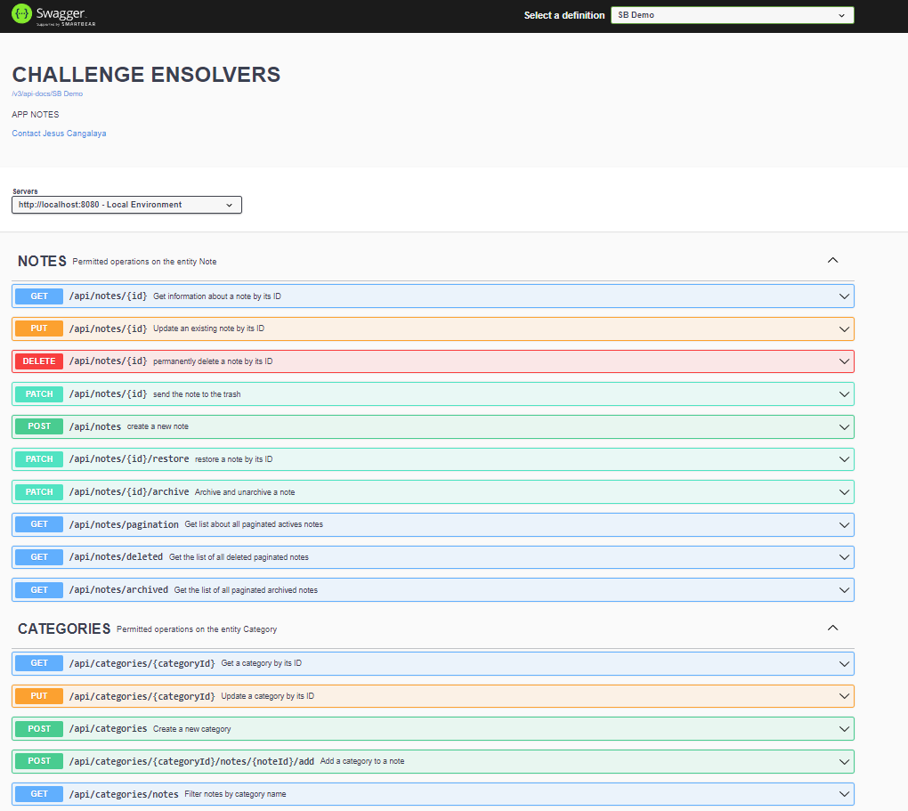

# App Note

## Tecnologías Utilizadas

- **Java Development Kit (JDK) 17:** Se requiere JDK 17 para ejecutar la aplicación.
- **Spring Boot 2.7.15:** Framework utilizado para el desarrollo.
- **Base de Datos MySQL:** Para almacenamiento de datos.
- **Maven:** Para la gestión y construcción del proyecto.
- **Swagger:** Para documentación de la API, accesible en http://localhost:8080/swagger-ui/index.html
  
## Configuración Inicial

Asegúrate de tener instalado JDK 17 y Maven en tu sistema antes de continuar. Puedes descargar JDK 17 desde [Oracle](https://www.oracle.com/java/technologies/javase-downloads.html) o [OpenJDK](https://adoptopenjdk.net/). Maven se puede instalar desde [Apache Maven](https://maven.apache.org/download.cgi).

## Ejecución de la Aplicación

Para ejecutar la aplicación, sigue estos pasos:

1. Clona el repositorio a tu máquina local.
2. Abre una terminal y navega al directorio del proyecto.
3. Asegúrate de que MySQL esté en ejecución en tu sistema.
  - La aplicación está configurada para crear automáticamente una base de datos llamada `challenge-ensolvers` si no existe. Asegúrate de que tu configuración de MySQL permita la creación de nuevas bases de datos.
- Se crearán dos tablas relacionadas: `notes` y `categories`, en una relación de muchos a muchos.
4. Ejecuta el comando `mvn spring-boot:run` para iniciar la aplicación.
5. Una vez iniciada, la aplicación estará disponible en `http://localhost:8080`.
6. Para acceder a la documentación de la API con Swagger, visita `http://localhost:8080/swagger-ui/index.html`.

## Funciones

- CRUD de notas.
- Validaciones básicas.
- Documentación con Swagger.
- Base de Datos MySql.
- Eliminación lógica.
- Uso de DTO para tranferencia de datos.
- MapStruct para simplificar mapeo de objetos Java y obtener un mejor performance a diferencia a otras librerias.
- @RestControllerAdvice para manejar excepciones globales en mi proyecto.
- Paginación eficiente para no sobrecargar con mucha data.
- Uso de Constantes para Mejor Legibilidad.
- Utilización de Genéricos para Flexibilidad.
- Campos validados:

